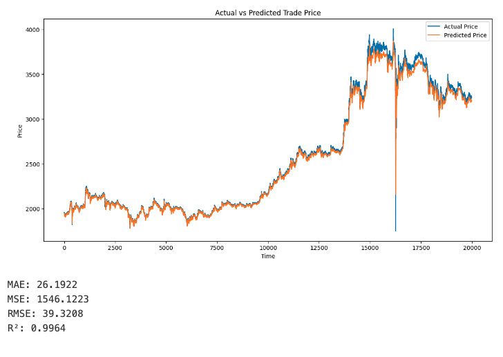

## 1번째

small 데이터 시험삼아 돌려봄

```python
input_features = [
    "high_price",
    "low_price",
    "trade_price",
    "candle_acc_trade_volume",
    # "hour",
    # "day_of_week",
    # "is_weekend",
    # "is_morning",
    # "rsi_14",
    # "obv",
    # "macd",
    # "macd_histogram"
]

input_size = len(input_features)
hidden_size = 50
num_layers = 2
output_size = 1
learning_rate = 0.001
num_epochs = 25 # 100
batch_size = 128
```

```
Epoch [1/25], Train Loss: 0.00071532, Test Loss: 0.01858269, Time: 9.33s, Current Time: 2025-01-15 09:37:21
Epoch [2/25], Train Loss: 0.00000229, Test Loss: 0.00824810, Time: 7.41s, Current Time: 2025-01-15 09:37:28
Epoch [3/25], Train Loss: 0.00000169, Test Loss: 0.00371772, Time: 7.76s, Current Time: 2025-01-15 09:37:36
Epoch [4/25], Train Loss: 0.00000169, Test Loss: 0.00270583, Time: 7.73s, Current Time: 2025-01-15 09:37:43
Epoch [5/25], Train Loss: 0.00000202, Test Loss: 0.00198401, Time: 7.45s, Current Time: 2025-01-15 09:37:51
Epoch [6/25], Train Loss: 0.00000164, Test Loss: 0.00126691, Time: 7.44s, Current Time: 2025-01-15 09:37:58
Epoch [7/25], Train Loss: 0.00000172, Test Loss: 0.00111043, Time: 7.71s, Current Time: 2025-01-15 09:38:06
Epoch [8/25], Train Loss: 0.00000165, Test Loss: 0.00082639, Time: 7.88s, Current Time: 2025-01-15 09:38:14
Epoch [9/25], Train Loss: 0.00000186, Test Loss: 0.00066356, Time: 7.90s, Current Time: 2025-01-15 09:38:22
Epoch [10/25], Train Loss: 0.00000172, Test Loss: 0.00060140, Time: 7.94s, Current Time: 2025-01-15 09:38:30
Epoch [11/25], Train Loss: 0.00000189, Test Loss: 0.00055178, Time: 7.68s, Current Time: 2025-01-15 09:38:37
Epoch [12/25], Train Loss: 0.00000139, Test Loss: 0.00042415, Time: 7.87s, Current Time: 2025-01-15 09:38:45
Epoch [13/25], Train Loss: 0.00000134, Test Loss: 0.00028297, Time: 7.94s, Current Time: 2025-01-15 09:38:53
Epoch [14/25], Train Loss: 0.00000152, Test Loss: 0.00022321, Time: 7.93s, Current Time: 2025-01-15 09:39:01
Epoch [15/25], Train Loss: 0.00000130, Test Loss: 0.00036244, Time: 7.88s, Current Time: 2025-01-15 09:39:09
EarlyStopping counter: 1 out of 5
Epoch [16/25], Train Loss: 0.00000111, Test Loss: 0.00019569, Time: 7.89s, Current Time: 2025-01-15 09:39:17
Epoch [17/25], Train Loss: 0.00000118, Test Loss: 0.00012541, Time: 7.88s, Current Time: 2025-01-15 09:39:25
Epoch [18/25], Train Loss: 0.00000113, Test Loss: 0.00014286, Time: 7.84s, Current Time: 2025-01-15 09:39:33
EarlyStopping counter: 1 out of 5
Epoch [19/25], Train Loss: 0.00000098, Test Loss: 0.00026441, Time: 7.93s, Current Time: 2025-01-15 09:39:41
EarlyStopping counter: 2 out of 5
Epoch [20/25], Train Loss: 0.00000107, Test Loss: 0.00016018, Time: 7.73s, Current Time: 2025-01-15 09:39:48
EarlyStopping counter: 3 out of 5
Epoch [21/25], Train Loss: 0.00000089, Test Loss: 0.00018662, Time: 7.89s, Current Time: 2025-01-15 09:39:56
EarlyStopping counter: 4 out of 5
Epoch [22/25], Train Loss: 0.00000059, Test Loss: 0.00014014, Time: 7.76s, Current Time: 2025-01-15 09:40:04
EarlyStopping counter: 5 out of 5
Early stopping
```


```
Actual: 1954.0, Predicted: 1948.09912109375

Actual: 1958.0001220703125, Predicted: 1948.2
496337890625

Actual: 1959.0001220703125, Predicted: 1949.0
347900390625

Actual: 1956.0, Predicted: 1950.41064453125

Actual: 1952.0, Predicted: 1950.33203125

Actual: 1956.0, Predicted: 1948.1893310546875

Actual: 1956.0, Predicted: 1947.913818359375

Actual: 1956.0, Predicted: 1948.1500244140625

Actual: 1952.0, Predicted: 1948.6473388671875

Actual: 1954.0, Predicted: 1947.4140625
```

----


## 두번째 

```python
input_features = [
    "high_price",
    "low_price",
    "trade_price",
    "candle_acc_trade_volume",
    "hour",
    "day_of_week",
    "is_weekend",
    "is_morning",
    "rsi_14",
    "obv",
    "macd",
    "macd_histogram"
]

input_size = len(input_features)
hidden_size = 50
num_layers = 2
output_size = 1
learning_rate = 0.001
num_epochs = 25 # 100
batch_size = 64

print("hidden_size:", hidden_size)
print("num_layers:", num_layers)
print("num_epochs:", num_epochs)
print("batch_size:", batch_size)
```

Epoch [1/25], Train Loss: 0.00022624, Test Loss: 0.01013517, Time: 16.19s, Current Time: 2025-01-15 09:48:19

Epoch [2/25], Train Loss: 0.00000295, Test Loss: 0.00470733, Time: 14.88s, Current Time: 2025-01-15 09:48:34

Epoch [3/25], Train Loss: 0.00000278, Test Loss: 0.00341359, Time: 15.02s, Current Time: 2025-01-15 09:48:49

Epoch [4/25], Train Loss: 0.00000239, Test Loss: 0.00226210, Time: 15.33s, Current Time: 2025-01-15 09:49:04

Epoch [5/25], Train Loss: 0.00000198, Test Loss: 0.00314313, Time: 15.34s, Current Time: 2025-01-15 09:49:19

EarlyStopping counter: 1 out of 5

Epoch [6/25], Train Loss: 0.00000201, Test Loss: 0.00260340, Time: 15.34s, Current Time: 2025-01-15 09:49:35

EarlyStopping counter: 2 out of 5

Epoch [7/25], Train Loss: 0.00000181, Test Loss: 0.00239341, Time: 15.29s, Current Time: 2025-01-15 09:49:50

EarlyStopping counter: 3 out of 5

Epoch [8/25], Train Loss: 0.00000165, Test Loss: 0.00263306, Time: 14.93s, Current Time: 2025-01-15 09:50:05

EarlyStopping counter: 4 out of 5

Epoch [9/25], Train Loss: 0.00000084, Test Loss: 0.00246305, Time: 15.37s, Current Time: 2025-01-15 09:50:20

EarlyStopping counter: 5 out of 5

Early stopping


MAE: 106.6714

MSE: 27173.2637

RMSE: 164.8431

R²: 0.9371


Actual: 1954.0, Predicted: 1947.307373046875

Actual: 1958.0001220703125, Predicted: 1947.1822509765625

Actual: 1959.0001220703125, Predicted: 1950.4248046875

Actual: 1956.0, Predicted: 1955.1063232421875

Actual: 1952.0, Predicted: 1952.725830078125

Actual: 1956.0, Predicted: 1948.4041748046875

Actual: 1956.0, Predicted: 1946.029052734375

Actual: 1956.0, Predicted: 1948.4617919921875

Actual: 1952.0, Predicted: 1951.0513916015625

Actual: 1954.0, Predicted: 1949.994384765625

---

## 3번째

```python
input_features = [
    "high_price",
    "low_price",
    "trade_price",
    "candle_acc_trade_volume",
    "hour",
    "day_of_week",
    "is_weekend",
    "is_morning",
    "rsi_14",
    "obv",
    "macd",
    "macd_histogram"
]

input_size = len(input_features)
hidden_size = 50
num_layers = 2
output_size = 1
learning_rate = 0.001
num_epochs = 25 # 100
batch_size = 128

print("hidden_size:", hidden_size)
print("num_layers:", num_layers)
print("num_epochs:", num_epochs)
print("batch_size:", batch_size)
```


```
Epoch [1/25], Train Loss: 0.00028025, Test Loss: 0.00854786, Time: 9.11s, Current Time: 2025-01-15 09:56:11
Epoch [2/25], Train Loss: 0.00000263, Test Loss: 0.00699508, Time: 7.42s, Current Time: 2025-01-15 09:56:18
Epoch [3/25], Train Loss: 0.00000251, Test Loss: 0.00627669, Time: 7.40s, Current Time: 2025-01-15 09:56:26
Epoch [4/25], Train Loss: 0.00000234, Test Loss: 0.00515029, Time: 7.75s, Current Time: 2025-01-15 09:56:33
Epoch [5/25], Train Loss: 0.00000201, Test Loss: 0.00510830, Time: 7.88s, Current Time: 2025-01-15 09:56:41
Epoch [6/25], Train Loss: 0.00000158, Test Loss: 0.00339849, Time: 7.94s, Current Time: 2025-01-15 09:56:49
Epoch [7/25], Train Loss: 0.00000184, Test Loss: 0.00352731, Time: 7.91s, Current Time: 2025-01-15 09:56:57
EarlyStopping counter: 1 out of 5
Epoch [8/25], Train Loss: 0.00000204, Test Loss: 0.00282465, Time: 7.76s, Current Time: 2025-01-15 09:57:05
Epoch [9/25], Train Loss: 0.00000148, Test Loss: 0.00304970, Time: 8.02s, Current Time: 2025-01-15 09:57:13
EarlyStopping counter: 1 out of 5
Epoch [10/25], Train Loss: 0.00000122, Test Loss: 0.00231287, Time: 8.00s, Current Time: 2025-01-15 09:57:21
Epoch [11/25], Train Loss: 0.00000160, Test Loss: 0.00244586, Time: 8.01s, Current Time: 2025-01-15 09:57:29
EarlyStopping counter: 1 out of 5
Epoch [12/25], Train Loss: 0.00000126, Test Loss: 0.00277934, Time: 7.81s, Current Time: 2025-01-15 09:57:37
EarlyStopping counter: 2 out of 5
Epoch [13/25], Train Loss: 0.00000135, Test Loss: 0.00212714, Time: 7.60s, Current Time: 2025-01-15 09:57:44
Epoch [14/25], Train Loss: 0.00000129, Test Loss: 0.00219670, Time: 7.42s, Current Time: 2025-01-15 09:57:52
EarlyStopping counter: 1 out of 5
Epoch [15/25], Train Loss: 0.00000129, Test Loss: 0.00227254, Time: 7.73s, Current Time: 2025-01-15 09:57:59
EarlyStopping counter: 2 out of 5
Epoch [16/25], Train Loss: 0.00000113, Test Loss: 0.00219821, Time: 7.97s, Current Time: 2025-01-15 09:58:07
EarlyStopping counter: 3 out of 5
Epoch [17/25], Train Loss: 0.00000124, Test Loss: 0.00207102, Time: 7.94s, Current Time: 2025-01-15 09:58:15
Epoch [18/25], Train Loss: 0.00000109, Test Loss: 0.00213409, Time: 8.03s, Current Time: 2025-01-15 09:58:23
...
Epoch [24/25], Train Loss: 0.00000078, Test Loss: 0.00142815, Time: 8.01s, Current Time: 2025-01-15 09:59:11
EarlyStopping counter: 2 out of 5
Epoch [25/25], Train Loss: 0.00000094, Test Loss: 0.00144161, Time: 8.12s, Current Time: 2025-01-15 09:59:19
EarlyStopping counter: 3 out of 5
```


```
MAE: 84.5672
MSE: 15904.3652
RMSE: 126.1125
R²: 0.9632
```


```
Actual: 1954.0, Predicted: 1949.710693359375
Actual: 1958.0001220703125, Predicted: 1951.128173828125
Actual: 1959.0001220703125, Predicted: 1954.8604736328125
Actual: 1956.0, Predicted: 1957.595458984375
Actual: 1952.0, Predicted: 1952.0281982421875
Actual: 1956.0, Predicted: 1949.4154052734375
Actual: 1956.0, Predicted: 1950.20654296875
Actual: 1956.0, Predicted: 1953.77685546875
Actual: 1952.0, Predicted: 1954.2740478515625
Actual: 1954.0, Predicted: 1951.1361083984375
```


## 4번째

```python
input_features = [
    "high_price",
    "low_price",
    "trade_price",
    "candle_acc_trade_volume",
    # "hour",
    # "day_of_week",
    # "is_weekend",
    # "is_morning",
    "rsi_14",
    "obv",
    "macd",
    "macd_histogram"
]

input_size = len(input_features)
hidden_size = 50
num_layers = 2
output_size = 1
learning_rate = 0.001
num_epochs = 25 # 100
batch_size = 128

print("hidden_size:", hidden_size)
print("num_layers:", num_layers)
print("num_epochs:", num_epochs)
print("batch_size:", batch_size)
```

```
Epoch [1/25], Train Loss: 0.00053552, Test Loss: 0.01222242, Time: 8.00s, Current Time: 2025-01-15 10:02:04
Epoch [2/25], Train Loss: 0.00000170, Test Loss: 0.00729850, Time: 7.59s, Current Time: 2025-01-15 10:02:11
Epoch [3/25], Train Loss: 0.00000127, Test Loss: 0.00439926, Time: 7.26s, Current Time: 2025-01-15 10:02:19
Epoch [4/25], Train Loss: 0.00000148, Test Loss: 0.00259850, Time: 7.51s, Current Time: 2025-01-15 10:02:26
Epoch [5/25], Train Loss: 0.00000160, Test Loss: 0.00168208, Time: 7.40s, Current Time: 2025-01-15 10:02:34
Epoch [6/25], Train Loss: 0.00000189, Test Loss: 0.00097988, Time: 8.24s, Current Time: 2025-01-15 10:02:42
Epoch [7/25], Train Loss: 0.00000149, Test Loss: 0.00152015, Time: 8.24s, Current Time: 2025-01-15 10:02:50
EarlyStopping counter: 1 out of 5
Epoch [8/25], Train Loss: 0.00000163, Test Loss: 0.00139579, Time: 8.24s, Current Time: 2025-01-15 10:02:58
EarlyStopping counter: 2 out of 5
Epoch [9/25], Train Loss: 0.00000140, Test Loss: 0.00115265, Time: 8.13s, Current Time: 2025-01-15 10:03:06
EarlyStopping counter: 3 out of 5
Epoch [10/25], Train Loss: 0.00000142, Test Loss: 0.00110429, Time: 8.28s, Current Time: 2025-01-15 10:03:15
EarlyStopping counter: 4 out of 5
Epoch [11/25], Train Loss: 0.00000071, Test Loss: 0.00096147, Time: 8.23s, Current Time: 2025-01-15 10:03:23
Epoch [12/25], Train Loss: 0.00000085, Test Loss: 0.00074889, Time: 8.18s, Current Time: 2025-01-15 10:03:31
Epoch [13/25], Train Loss: 0.00000091, Test Loss: 0.00073962, Time: 7.89s, Current Time: 2025-01-15 10:03:39
Epoch [14/25], Train Loss: 0.00000084, Test Loss: 0.00070057, Time: 7.91s, Current Time: 2025-01-15 10:03:47
Epoch [15/25], Train Loss: 0.00000095, Test Loss: 0.00071219, Time: 7.82s, Current Time: 2025-01-15 10:03:55
EarlyStopping counter: 1 out of 5
Epoch [16/25], Train Loss: 0.00000096, Test Loss: 0.00049688, Time: 7.48s, Current Time: 2025-01-15 10:04:02
Epoch [17/25], Train Loss: 0.00000076, Test Loss: 0.00048682, Time: 7.75s, Current Time: 2025-01-15 10:04:10
Epoch [18/25], Train Loss: 0.00000087, Test Loss: 0.00045971, Time: 8.22s, Current Time: 2025-01-15 10:04:18
Epoch [19/25], Train Loss: 0.00000084, Test Loss: 0.00047729, Time: 8.25s, Current Time: 2025-01-15 10:04:26
EarlyStopping counter: 1 out of 5
...
Epoch [23/25], Train Loss: 0.00000055, Test Loss: 0.00038771, Time: 8.16s, Current Time: 2025-01-15 10:04:59
Epoch [24/25], Train Loss: 0.00000057, Test Loss: 0.00040935, Time: 8.22s, Current Time: 2025-01-15 10:05:08
EarlyStopping counter: 1 out of 5
Epoch [25/25], Train Loss: 0.00000059, Test Loss: 0.00038049, Time: 8.22s, Current Time: 2025-01-15 10:05:16
```

```
MAE: 39.4283
MSE: 4197.7178
RMSE: 64.7898
R²: 0.9903
```
```
Actual: 1954.0, Predicted: 1949.3681640625
Actual: 1958.0001220703125, Predicted: 1949.540771484375
Actual: 1959.0001220703125, Predicted: 1953.73828125
Actual: 1956.0, Predicted: 1958.983642578125
Actual: 1952.0, Predicted: 1955.4464111328125
Actual: 1956.0, Predicted: 1950.573486328125
Actual: 1956.0, Predicted: 1948.49609375
Actual: 1956.0, Predicted: 1952.251220703125
Actual: 1952.0, Predicted: 1955.06201171875
Actual: 1954.0, Predicted: 1953.32177734375
```
---

## 5번째

```
# 선택된 피처 리스트
input_features = [
    "high_price",
    "low_price",
    "trade_price",
    "candle_acc_trade_volume",
    # "hour",
    # "day_of_week",
    # "is_weekend",
    # "is_morning",
    "rsi_14",
    "obv",
    "macd",
    "macd_histogram"
]

input_size = len(input_features)
hidden_size = 50
num_layers = 2
output_size = 1
learning_rate = 0.001
num_epochs = 100 # 100
batch_size = 128

print("hidden_size:", hidden_size)
print("num_layers:", num_layers)
print("num_epochs:", num_epochs)
print("batch_size:", batch_size)
```

```
/home/dowonseo/anaconda3/envs/upbit/lib/python3.11/site-packages/torch/optim/lr_scheduler.py:62: UserWarning: The verbose parameter is deprecated. Please use get_last_lr() to access the learning rate.
  warnings.warn(
Epoch [1/100], Train Loss: 0.00064992, Test Loss: 0.01761148, Time: 8.96s, Current Time: 2025-01-15 10:17:33
Epoch [2/100], Train Loss: 0.00000186, Test Loss: 0.00664935, Time: 7.54s, Current Time: 2025-01-15 10:17:40
Epoch [3/100], Train Loss: 0.00000133, Test Loss: 0.00421802, Time: 7.56s, Current Time: 2025-01-15 10:17:48
Epoch [4/100], Train Loss: 0.00000196, Test Loss: 0.00379312, Time: 7.71s, Current Time: 2025-01-15 10:17:55
Epoch [5/100], Train Loss: 0.00000173, Test Loss: 0.00332899, Time: 7.64s, Current Time: 2025-01-15 10:18:03
Epoch [6/100], Train Loss: 0.00000184, Test Loss: 0.00308724, Time: 7.66s, Current Time: 2025-01-15 10:18:11
Epoch [7/100], Train Loss: 0.00000180, Test Loss: 0.00242283, Time: 7.66s, Current Time: 2025-01-15 10:18:18
Epoch [8/100], Train Loss: 0.00000202, Test Loss: 0.00210513, Time: 7.89s, Current Time: 2025-01-15 10:18:26
Epoch [9/100], Train Loss: 0.00000162, Test Loss: 0.00195339, Time: 7.68s, Current Time: 2025-01-15 10:18:34
Epoch [10/100], Train Loss: 0.00000171, Test Loss: 0.00155951, Time: 7.73s, Current Time: 2025-01-15 10:18:42
Epoch [11/100], Train Loss: 0.00000152, Test Loss: 0.00169810, Time: 7.70s, Current Time: 2025-01-15 10:18:49
EarlyStopping counter: 1 out of 10
Epoch [12/100], Train Loss: 0.00000150, Test Loss: 0.00150467, Time: 7.87s, Current Time: 2025-01-15 10:18:57
Epoch [13/100], Train Loss: 0.00000152, Test Loss: 0.00136559, Time: 7.81s, Current Time: 2025-01-15 10:19:05
Epoch [14/100], Train Loss: 0.00000140, Test Loss: 0.00130525, Time: 7.92s, Current Time: 2025-01-15 10:19:13
Epoch [15/100], Train Loss: 0.00000135, Test Loss: 0.00096568, Time: 7.87s, Current Time: 2025-01-15 10:19:21
Epoch [16/100], Train Loss: 0.00000118, Test Loss: 0.00094822, Time: 7.94s, Current Time: 2025-01-15 10:19:29
Epoch [17/100], Train Loss: 0.00000117, Test Loss: 0.00095323, Time: 8.01s, Current Time: 2025-01-15 10:19:37
EarlyStopping counter: 1 out of 10
Epoch [18/100], Train Loss: 0.00000135, Test Loss: 0.00113131, Time: 7.96s, Current Time: 2025-01-15 10:19:45
EarlyStopping counter: 2 out of 10
Epoch [19/100], Train Loss: 0.00000126, Test Loss: 0.00096283, Time: 7.99s, Current Time: 2025-01-15 10:19:53
EarlyStopping counter: 3 out of 10
Epoch [20/100], Train Loss: 0.00000103, Test Loss: 0.00079810, Time: 7.93s, Current Time: 2025-01-15 10:20:01
Epoch [21/100], Train Loss: 0.00000111, Test Loss: 0.00069762, Time: 7.93s, Current Time: 2025-01-15 10:20:09
Epoch [22/100], Train Loss: 0.00000107, Test Loss: 0.00057005, Time: 7.92s, Current Time: 2025-01-15 10:20:17
Epoch [23/100], Train Loss: 0.00000091, Test Loss: 0.00047939, Time: 8.02s, Current Time: 2025-01-15 10:20:25
Epoch [24/100], Train Loss: 0.00000112, Test Loss: 0.00052215, Time: 7.68s, Current Time: 2025-01-15 10:20:32
EarlyStopping counter: 1 out of 10
Epoch [25/100], Train Loss: 0.00000082, Test Loss: 0.00053375, Time: 7.47s, Current Time: 2025-01-15 10:20:40
EarlyStopping counter: 2 out of 10
Epoch [26/100], Train Loss: 0.00000086, Test Loss: 0.00047586, Time: 7.95s, Current Time: 2025-01-15 10:20:48
Epoch [27/100], Train Loss: 0.00000099, Test Loss: 0.00030471, Time: 7.90s, Current Time: 2025-01-15 10:20:56
Epoch [28/100], Train Loss: 0.00000091, Test Loss: 0.00033311, Time: 7.93s, Current Time: 2025-01-15 10:21:04
EarlyStopping counter: 1 out of 10
Epoch [29/100], Train Loss: 0.00000071, Test Loss: 0.00027905, Time: 8.01s, Current Time: 2025-01-15 10:21:12
Epoch [30/100], Train Loss: 0.00000092, Test Loss: 0.00032452, Time: 7.98s, Current Time: 2025-01-15 10:21:20
EarlyStopping counter: 1 out of 10
Epoch [31/100], Train Loss: 0.00000078, Test Loss: 0.00028982, Time: 7.96s, Current Time: 2025-01-15 10:21:27
EarlyStopping counter: 2 out of 10
Epoch [32/100], Train Loss: 0.00000073, Test Loss: 0.00029972, Time: 7.92s, Current Time: 2025-01-15 10:21:35
EarlyStopping counter: 3 out of 10
Epoch [33/100], Train Loss: 0.00000098, Test Loss: 0.00020536, Time: 7.94s, Current Time: 2025-01-15 10:21:43
Epoch [34/100], Train Loss: 0.00000072, Test Loss: 0.00016967, Time: 7.88s, Current Time: 2025-01-15 10:21:51
Epoch [35/100], Train Loss: 0.00000073, Test Loss: 0.00021836, Time: 7.89s, Current Time: 2025-01-15 10:21:59
EarlyStopping counter: 1 out of 10
Epoch [36/100], Train Loss: 0.00000087, Test Loss: 0.00017666, Time: 7.99s, Current Time: 2025-01-15 10:22:07
EarlyStopping counter: 2 out of 10
Epoch [37/100], Train Loss: 0.00000080, Test Loss: 0.00028920, Time: 7.96s, Current Time: 2025-01-15 10:22:15
EarlyStopping counter: 3 out of 10
Epoch [38/100], Train Loss: 0.00000064, Test Loss: 0.00027412, Time: 7.93s, Current Time: 2025-01-15 10:22:23
EarlyStopping counter: 4 out of 10
Epoch [39/100], Train Loss: 0.00000043, Test Loss: 0.00016735, Time: 8.00s, Current Time: 2025-01-15 10:22:31
Epoch [40/100], Train Loss: 0.00000049, Test Loss: 0.00017579, Time: 7.89s, Current Time: 2025-01-15 10:22:39
EarlyStopping counter: 1 out of 10
Epoch [41/100], Train Loss: 0.00000046, Test Loss: 0.00013470, Time: 7.44s, Current Time: 2025-01-15 10:22:46
Epoch [42/100], Train Loss: 0.00000048, Test Loss: 0.00012150, Time: 8.00s, Current Time: 2025-01-15 10:22:54
Epoch [43/100], Train Loss: 0.00000050, Test Loss: 0.00017076, Time: 7.89s, Current Time: 2025-01-15 10:23:02
EarlyStopping counter: 1 out of 10
Epoch [44/100], Train Loss: 0.00000047, Test Loss: 0.00014757, Time: 8.02s, Current Time: 2025-01-15 10:23:10
EarlyStopping counter: 2 out of 10
Epoch [45/100], Train Loss: 0.00000048, Test Loss: 0.00016321, Time: 7.94s, Current Time: 2025-01-15 10:23:18
EarlyStopping counter: 3 out of 10
Epoch [46/100], Train Loss: 0.00000049, Test Loss: 0.00010738, Time: 8.00s, Current Time: 2025-01-15 10:23:26
Epoch [47/100], Train Loss: 0.00000046, Test Loss: 0.00020186, Time: 7.93s, Current Time: 2025-01-15 10:23:34
EarlyStopping counter: 1 out of 10
Epoch [48/100], Train Loss: 0.00000050, Test Loss: 0.00018739, Time: 7.93s, Current Time: 2025-01-15 10:23:42
EarlyStopping counter: 2 out of 10
Epoch [49/100], Train Loss: 0.00000052, Test Loss: 0.00010545, Time: 7.99s, Current Time: 2025-01-15 10:23:50
Epoch [50/100], Train Loss: 0.00000044, Test Loss: 0.00016134, Time: 7.95s, Current Time: 2025-01-15 10:23:58
EarlyStopping counter: 1 out of 10
Epoch [51/100], Train Loss: 0.00000048, Test Loss: 0.00016553, Time: 7.90s, Current Time: 2025-01-15 10:24:06
EarlyStopping counter: 2 out of 10
Epoch [52/100], Train Loss: 0.00000045, Test Loss: 0.00017458, Time: 7.98s, Current Time: 2025-01-15 10:24:14
EarlyStopping counter: 3 out of 10
Epoch [53/100], Train Loss: 0.00000043, Test Loss: 0.00013853, Time: 7.93s, Current Time: 2025-01-15 10:24:22
EarlyStopping counter: 4 out of 10
Epoch [54/100], Train Loss: 0.00000038, Test Loss: 0.00016638, Time: 7.94s, Current Time: 2025-01-15 10:24:30
EarlyStopping counter: 5 out of 10
Epoch [55/100], Train Loss: 0.00000038, Test Loss: 0.00016053, Time: 7.95s, Current Time: 2025-01-15 10:24:38
EarlyStopping counter: 6 out of 10
Epoch [56/100], Train Loss: 0.00000040, Test Loss: 0.00018960, Time: 7.97s, Current Time: 2025-01-15 10:24:46
EarlyStopping counter: 7 out of 10
Epoch [57/100], Train Loss: 0.00000039, Test Loss: 0.00014930, Time: 7.96s, Current Time: 2025-01-15 10:24:54
EarlyStopping counter: 8 out of 10
Epoch [58/100], Train Loss: 0.00000035, Test Loss: 0.00013280, Time: 7.86s, Current Time: 2025-01-15 10:25:01
EarlyStopping counter: 9 out of 10
Epoch [59/100], Train Loss: 0.00000035, Test Loss: 0.00011277, Time: 7.98s, Current Time: 2025-01-15 10:25:09
EarlyStopping counter: 10 out of 10
Early stopping
```


```
MAE: 19.4729
MSE: 1244.1472
RMSE: 35.2725
R²: 0.9971
```

```
Actual: 1954.0, Predicted: 1957.5394287109375
Actual: 1958.0001220703125, Predicted: 1956.3021240234375
Actual: 1959.0001220703125, Predicted: 1959.8585205078125
Actual: 1956.0, Predicted: 1959.734619140625
Actual: 1952.0, Predicted: 1958.25634765625
Actual: 1956.0, Predicted: 1954.742431640625
Actual: 1956.0, Predicted: 1958.126220703125
Actual: 1956.0, Predicted: 1957.322265625
Actual: 1952.0, Predicted: 1957.7239990234375
Actual: 1954.0, Predicted: 1954.566650390625
```

---
## 6번째 (레전드)


```python
# 선택된 피처 리스트
input_features = [
    "high_price",
    "low_price",
    "trade_price",
    "candle_acc_trade_volume",
    # "hour",
    # "day_of_week",
    # "is_weekend",
    # "is_morning",
    "rsi_14",
    # "obv",
    # "macd",
    "macd_histogram"
]

input_size = len(input_features)
hidden_size = 50
num_layers = 2
output_size = 1
learning_rate = 0.001
num_epochs = 100 # 100
batch_size = 128

print("hidden_size:", hidden_size)
print("num_layers:", num_layers)
print("num_epochs:", num_epochs)
print("batch_size:", batch_size)
```

```
Epoch [1/100], Train Loss: 0.00033016, Test Loss: 0.00890932, Time: 8.26s, Current Time: 2025-01-15 10:30:55
Epoch [2/100], Train Loss: 0.00000143, Test Loss: 0.00538382, Time: 5.76s, Current Time: 2025-01-15 10:31:01
Epoch [3/100], Train Loss: 0.00000150, Test Loss: 0.00197320, Time: 6.20s, Current Time: 2025-01-15 10:31:07
Epoch [4/100], Train Loss: 0.00000150, Test Loss: 0.00041954, Time: 6.27s, Current Time: 2025-01-15 10:31:13
Epoch [5/100], Train Loss: 0.00000187, Test Loss: 0.00021881, Time: 7.85s, Current Time: 2025-01-15 10:31:21
Epoch [6/100], Train Loss: 0.00000185, Test Loss: 0.00012922, Time: 7.90s, Current Time: 2025-01-15 10:31:29
Epoch [7/100], Train Loss: 0.00000147, Test Loss: 0.00010546, Time: 7.93s, Current Time: 2025-01-15 10:31:37
Epoch [8/100], Train Loss: 0.00000142, Test Loss: 0.00009059, Time: 7.89s, Current Time: 2025-01-15 10:31:45
Epoch [9/100], Train Loss: 0.00000161, Test Loss: 0.00008419, Time: 7.74s, Current Time: 2025-01-15 10:31:52
Epoch [10/100], Train Loss: 0.00000123, Test Loss: 0.00008000, Time: 7.91s, Current Time: 2025-01-15 10:32:00
Epoch [11/100], Train Loss: 0.00000149, Test Loss: 0.00025436, Time: 7.73s, Current Time: 2025-01-15 10:32:08
EarlyStopping counter: 1 out of 10
Epoch [12/100], Train Loss: 0.00000115, Test Loss: 0.00009326, Time: 7.34s, Current Time: 2025-01-15 10:32:15
EarlyStopping counter: 2 out of 10
Epoch [13/100], Train Loss: 0.00000116, Test Loss: 0.00011222, Time: 7.68s, Current Time: 2025-01-15 10:32:23
EarlyStopping counter: 3 out of 10
Epoch [14/100], Train Loss: 0.00000120, Test Loss: 0.00022878, Time: 7.40s, Current Time: 2025-01-15 10:32:30
EarlyStopping counter: 4 out of 10
Epoch [15/100], Train Loss: 0.00000066, Test Loss: 0.00009331, Time: 5.60s, Current Time: 2025-01-15 10:32:36
EarlyStopping counter: 5 out of 10
Epoch [16/100], Train Loss: 0.00000069, Test Loss: 0.00005852, Time: 5.56s, Current Time: 2025-01-15 10:32:42
Epoch [17/100], Train Loss: 0.00000073, Test Loss: 0.00005170, Time: 7.57s, Current Time: 2025-01-15 10:32:49
Epoch [18/100], Train Loss: 0.00000077, Test Loss: 0.00005071, Time: 7.55s, Current Time: 2025-01-15 10:32:57
Epoch [19/100], Train Loss: 0.00000070, Test Loss: 0.00005788, Time: 7.51s, Current Time: 2025-01-15 10:33:04
EarlyStopping counter: 1 out of 10
Epoch [20/100], Train Loss: 0.00000075, Test Loss: 0.00007286, Time: 7.42s, Current Time: 2025-01-15 10:33:12
EarlyStopping counter: 2 out of 10
Epoch [21/100], Train Loss: 0.00000071, Test Loss: 0.00004876, Time: 7.73s, Current Time: 2025-01-15 10:33:19
Epoch [22/100], Train Loss: 0.00000070, Test Loss: 0.00009177, Time: 7.58s, Current Time: 2025-01-15 10:33:27
EarlyStopping counter: 1 out of 10
Epoch [23/100], Train Loss: 0.00000070, Test Loss: 0.00009782, Time: 7.77s, Current Time: 2025-01-15 10:33:35
EarlyStopping counter: 2 out of 10
Epoch [24/100], Train Loss: 0.00000067, Test Loss: 0.00004661, Time: 7.80s, Current Time: 2025-01-15 10:33:42
Epoch [25/100], Train Loss: 0.00000066, Test Loss: 0.00006914, Time: 7.62s, Current Time: 2025-01-15 10:33:50
EarlyStopping counter: 1 out of 10
Epoch [26/100], Train Loss: 0.00000063, Test Loss: 0.00007335, Time: 7.58s, Current Time: 2025-01-15 10:33:58
EarlyStopping counter: 2 out of 10
Epoch [27/100], Train Loss: 0.00000063, Test Loss: 0.00011070, Time: 7.53s, Current Time: 2025-01-15 10:34:05
EarlyStopping counter: 3 out of 10
Epoch [28/100], Train Loss: 0.00000061, Test Loss: 0.00005835, Time: 7.57s, Current Time: 2025-01-15 10:34:13
EarlyStopping counter: 4 out of 10
Epoch [29/100], Train Loss: 0.00000047, Test Loss: 0.00004106, Time: 7.69s, Current Time: 2025-01-15 10:34:20
Epoch [30/100], Train Loss: 0.00000048, Test Loss: 0.00004924, Time: 7.57s, Current Time: 2025-01-15 10:34:28
EarlyStopping counter: 1 out of 10
Epoch [31/100], Train Loss: 0.00000049, Test Loss: 0.00004058, Time: 7.58s, Current Time: 2025-01-15 10:34:36
Epoch [32/100], Train Loss: 0.00000046, Test Loss: 0.00004133, Time: 7.26s, Current Time: 2025-01-15 10:34:43
EarlyStopping counter: 1 out of 10
Epoch [33/100], Train Loss: 0.00000050, Test Loss: 0.00003833, Time: 6.89s, Current Time: 2025-01-15 10:34:50
Epoch [34/100], Train Loss: 0.00000048, Test Loss: 0.00004934, Time: 7.73s, Current Time: 2025-01-15 10:34:58
EarlyStopping counter: 1 out of 10
Epoch [35/100], Train Loss: 0.00000046, Test Loss: 0.00004510, Time: 7.80s, Current Time: 2025-01-15 10:35:05
EarlyStopping counter: 2 out of 10
Epoch [36/100], Train Loss: 0.00000045, Test Loss: 0.00006389, Time: 7.81s, Current Time: 2025-01-15 10:35:13
EarlyStopping counter: 3 out of 10
Epoch [37/100], Train Loss: 0.00000047, Test Loss: 0.00004683, Time: 7.86s, Current Time: 2025-01-15 10:35:21
EarlyStopping counter: 4 out of 10
Epoch [38/100], Train Loss: 0.00000040, Test Loss: 0.00003538, Time: 7.79s, Current Time: 2025-01-15 10:35:29
Epoch [39/100], Train Loss: 0.00000040, Test Loss: 0.00003119, Time: 7.75s, Current Time: 2025-01-15 10:35:37
Epoch [40/100], Train Loss: 0.00000041, Test Loss: 0.00004377, Time: 7.79s, Current Time: 2025-01-15 10:35:44
EarlyStopping counter: 1 out of 10
Epoch [41/100], Train Loss: 0.00000040, Test Loss: 0.00003807, Time: 7.80s, Current Time: 2025-01-15 10:35:52
EarlyStopping counter: 2 out of 10
Epoch [42/100], Train Loss: 0.00000040, Test Loss: 0.00003117, Time: 7.77s, Current Time: 2025-01-15 10:36:00
Epoch [43/100], Train Loss: 0.00000041, Test Loss: 0.00004119, Time: 7.51s, Current Time: 2025-01-15 10:36:07
EarlyStopping counter: 1 out of 10
Epoch [44/100], Train Loss: 0.00000040, Test Loss: 0.00004570, Time: 7.72s, Current Time: 2025-01-15 10:36:15
EarlyStopping counter: 2 out of 10
Epoch [45/100], Train Loss: 0.00000039, Test Loss: 0.00003286, Time: 7.74s, Current Time: 2025-01-15 10:36:23
EarlyStopping counter: 3 out of 10
Epoch [46/100], Train Loss: 0.00000039, Test Loss: 0.00003449, Time: 7.70s, Current Time: 2025-01-15 10:36:31
EarlyStopping counter: 4 out of 10
Epoch [47/100], Train Loss: 0.00000037, Test Loss: 0.00003138, Time: 7.76s, Current Time: 2025-01-15 10:36:38
EarlyStopping counter: 5 out of 10
Epoch [48/100], Train Loss: 0.00000037, Test Loss: 0.00003826, Time: 7.78s, Current Time: 2025-01-15 10:36:46
EarlyStopping counter: 6 out of 10
Epoch [49/100], Train Loss: 0.00000038, Test Loss: 0.00003324, Time: 7.76s, Current Time: 2025-01-15 10:36:54
EarlyStopping counter: 7 out of 10
Epoch [50/100], Train Loss: 0.00000036, Test Loss: 0.00003137, Time: 7.73s, Current Time: 2025-01-15 10:37:02
EarlyStopping counter: 8 out of 10
Epoch [51/100], Train Loss: 0.00000035, Test Loss: 0.00003601, Time: 7.60s, Current Time: 2025-01-15 10:37:09
EarlyStopping counter: 9 out of 10
Epoch [52/100], Train Loss: 0.00000036, Test Loss: 0.00003402, Time: 7.70s, Current Time: 2025-01-15 10:37:17
EarlyStopping counter: 10 out of 10
Early stopping
```


```
MAE: 9.2421
MSE: 375.3169
RMSE: 19.3731
R²: 0.9991
```

```
Actual: 1954.0, Predicted: 1952.6773681640625
Actual: 1958.0001220703125, Predicted: 1954.072021484375
Actual: 1959.0001220703125, Predicted: 1957.5648193359375
Actual: 1956.0, Predicted: 1959.5101318359375
Actual: 1952.0, Predicted: 1954.9544677734375
Actual: 1956.0, Predicted: 1952.626220703125
Actual: 1956.0, Predicted: 1953.806640625
Actual: 1956.0, Predicted: 1956.739990234375
Actual: 1952.0, Predicted: 1956.41357421875
Actual: 1954.0, Predicted: 1953.2606201171875
```

---

## 7번째

```python
# 선택된 피처 리스트
input_features = [
    "high_price",
    "low_price",
    "trade_price",
    "candle_acc_trade_volume",
    "rsi_14",
    "macd_histogram",

    # "atr_14",
    "stoch_k",
    "stoch_d",
]

input_size = len(input_features)
hidden_size = 50
num_layers = 2
output_size = 1
learning_rate = 0.001
num_epochs = 100 # 100
batch_size = 128

print("hidden_size:", hidden_size)
print("num_layers:", num_layers)
print("num_epochs:", num_epochs)
print("batch_size:", batch_size)
```

```
Epoch [1/100], Train Loss: 0.00020547, Test Loss: 0.00364273, Time: 9.10s, Current Time: 2025-01-15 11:12:19
Epoch [2/100], Train Loss: 0.00000269, Test Loss: 0.00280959, Time: 7.57s, Current Time: 2025-01-15 11:12:27
Epoch [3/100], Train Loss: 0.00000240, Test Loss: 0.00182183, Time: 7.90s, Current Time: 2025-01-15 11:12:35
Epoch [4/100], Train Loss: 0.00000208, Test Loss: 0.00211592, Time: 7.98s, Current Time: 2025-01-15 11:12:43
EarlyStopping counter: 1 out of 10
Epoch [5/100], Train Loss: 0.00000217, Test Loss: 0.00157824, Time: 7.94s, Current Time: 2025-01-15 11:12:51
Epoch [6/100], Train Loss: 0.00000171, Test Loss: 0.00047696, Time: 8.01s, Current Time: 2025-01-15 11:12:59
Epoch [7/100], Train Loss: 0.00000162, Test Loss: 0.00065283, Time: 7.97s, Current Time: 2025-01-15 11:13:07
EarlyStopping counter: 1 out of 10
Epoch [8/100], Train Loss: 0.00000175, Test Loss: 0.00066509, Time: 8.00s, Current Time: 2025-01-15 11:13:15
EarlyStopping counter: 2 out of 10
Epoch [9/100], Train Loss: 0.00000150, Test Loss: 0.00048886, Time: 7.92s, Current Time: 2025-01-15 11:13:23
EarlyStopping counter: 3 out of 10
Epoch [10/100], Train Loss: 0.00000175, Test Loss: 0.00048883, Time: 7.95s, Current Time: 2025-01-15 11:13:31
EarlyStopping counter: 4 out of 10
Epoch [11/100], Train Loss: 0.00000080, Test Loss: 0.00042006, Time: 7.98s, Current Time: 2025-01-15 11:13:39
Epoch [12/100], Train Loss: 0.00000071, Test Loss: 0.00030298, Time: 7.98s, Current Time: 2025-01-15 11:13:47
Epoch [13/100], Train Loss: 0.00000082, Test Loss: 0.00016864, Time: 8.00s, Current Time: 2025-01-15 11:13:55
Epoch [14/100], Train Loss: 0.00000098, Test Loss: 0.00031954, Time: 7.98s, Current Time: 2025-01-15 11:14:03
EarlyStopping counter: 1 out of 10
Epoch [15/100], Train Loss: 0.00000088, Test Loss: 0.00037772, Time: 7.92s, Current Time: 2025-01-15 11:14:11
EarlyStopping counter: 2 out of 10
Epoch [16/100], Train Loss: 0.00000077, Test Loss: 0.00048156, Time: 7.92s, Current Time: 2025-01-15 11:14:19
EarlyStopping counter: 3 out of 10
Epoch [17/100], Train Loss: 0.00000087, Test Loss: 0.00026539, Time: 7.95s, Current Time: 2025-01-15 11:14:26
...
EarlyStopping counter: 9 out of 10
Epoch [54/100], Train Loss: 0.00000041, Test Loss: 0.00013849, Time: 7.40s, Current Time: 2025-01-15 11:19:18
EarlyStopping counter: 10 out of 10
Early stopping
```

```
MAE: 22.6456
MSE: 1527.8668
RMSE: 39.0879
R²: 0.9965
```
```
Actual: 1956.0, Predicted: 1959.1373291015625
Actual: 1952.0, Predicted: 1956.625
Actual: 1956.0, Predicted: 1951.13330078125
Actual: 1956.0, Predicted: 1949.481201171875
Actual: 1956.0, Predicted: 1953.072265625
Actual: 1952.0, Predicted: 1956.5848388671875
Actual: 1954.0, Predicted: 1953.876220703125
Actual: 1951.0001220703125, Predicted: 1950.268310546875
Actual: 1949.0001220703125, Predicted: 1945.4891357421875
Actual: 1949.0001220703125, Predicted: 1942.8016357421875
```

## 8번째 (7번째와 동일 조건)

```python
# 선택된 피처 리스트
input_features = [
    "high_price",
    "low_price",
    "trade_price",
    "candle_acc_trade_volume",
    "rsi_14",
    "macd_histogram",

    # "atr_14",
    "stoch_k",
    "stoch_d",
]

input_size = len(input_features)
hidden_size = 50
num_layers = 2
output_size = 1
learning_rate = 0.001
num_epochs = 100 # 100
batch_size = 128

print("hidden_size:", hidden_size)
print("num_layers:", num_layers)
print("num_epochs:", num_epochs)
print("batch_size:", batch_size)
```

```
Epoch [1/100], Train Loss: 0.00038323, Test Loss: 0.01369067, Time: 8.96s, Current Time: 2025-01-15 12:25:46
Epoch [2/100], Train Loss: 0.00000158, Test Loss: 0.00768539, Time: 7.05s, Current Time: 2025-01-15 12:25:53
Epoch [3/100], Train Loss: 0.00000129, Test Loss: 0.00400207, Time: 7.38s, Current Time: 2025-01-15 12:26:01
Epoch [4/100], Train Loss: 0.00000134, Test Loss: 0.00311226, Time: 7.62s, Current Time: 2025-01-15 12:26:08
Epoch [5/100], Train Loss: 0.00000185, Test Loss: 0.00191710, Time: 7.71s, Current Time: 2025-01-15 12:26:16
Epoch [6/100], Train Loss: 0.00000147, Test Loss: 0.00133225, Time: 7.57s, Current Time: 2025-01-15 12:26:24
Epoch [7/100], Train Loss: 0.00000170, Test Loss: 0.00198986, Time: 7.74s, Current Time: 2025-01-15 12:26:31
EarlyStopping counter: 1 out of 10
Epoch [8/100], Train Loss: 0.00000147, Test Loss: 0.00210234, Time: 7.72s, Current Time: 2025-01-15 12:26:39
EarlyStopping counter: 2 out of 10
Epoch [9/100], Train Loss: 0.00000129, Test Loss: 0.00206164, Time: 7.76s, Current Time: 2025-01-15 12:26:47
EarlyStopping counter: 3 out of 10
Epoch [10/100], Train Loss: 0.00000131, Test Loss: 0.00163673, Time: 7.96s, Current Time: 2025-01-15 12:26:55
EarlyStopping counter: 4 out of 10
Epoch [11/100], Train Loss: 0.00000072, Test Loss: 0.00169485, Time: 7.87s, Current Time: 2025-01-15 12:27:03
EarlyStopping counter: 5 out of 10
Epoch [12/100], Train Loss: 0.00000074, Test Loss: 0.00166622, Time: 7.79s, Current Time: 2025-01-15 12:27:11
EarlyStopping counter: 6 out of 10
Epoch [13/100], Train Loss: 0.00000087, Test Loss: 0.00127494, Time: 7.81s, Current Time: 2025-01-15 12:27:18
Epoch [14/100], Train Loss: 0.00000087, Test Loss: 0.00147383, Time: 7.83s, Current Time: 2025-01-15 12:27:26
EarlyStopping counter: 1 out of 10
Epoch [15/100], Train Loss: 0.00000091, Test Loss: 0.00123592, Time: 7.71s, Current Time: 2025-01-15 12:27:34
Epoch [16/100], Train Loss: 0.00000087, Test Loss: 0.00152818, Time: 7.86s, Current Time: 2025-01-15 12:27:42
EarlyStopping counter: 1 out of 10
Epoch [17/100], Train Loss: 0.00000081, Test Loss: 0.00163241, Time: 7.33s, Current Time: 2025-01-15 12:27:49
...
EarlyStopping counter: 9 out of 10
Epoch [85/100], Train Loss: 0.00000035, Test Loss: 0.00042559, Time: 7.75s, Current Time: 2025-01-15 12:36:32
EarlyStopping counter: 10 out of 10
Early stopping
```


```
MAE: 38.1450
MSE: 4695.3003
RMSE: 68.5223
R²: 0.9891
```


```
Actual: 1956.0, Predicted: 1962.142822265625
Actual: 1952.0, Predicted: 1956.037841796875
Actual: 1956.0, Predicted: 1951.7547607421875
Actual: 1956.0, Predicted: 1954.78515625
Actual: 1956.0, Predicted: 1958.7725830078125
Actual: 1952.0, Predicted: 1959.14697265625
Actual: 1954.0, Predicted: 1953.175048828125
Actual: 1951.0001220703125, Predicted: 1952.2215576171875
Actual: 1949.0001220703125, Predicted: 1949.4908447265625
Actual: 1949.0001220703125, Predicted: 1948.372314453125
```