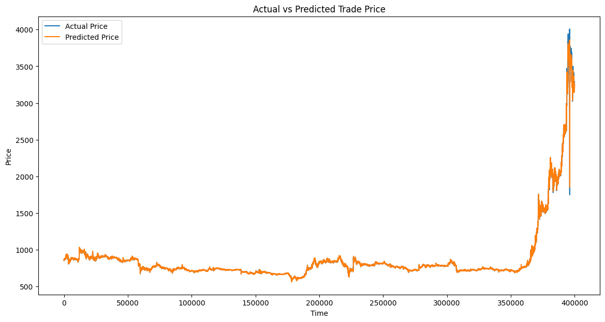

# 풀 학습

## 1. 2025-01-14/KRW-XRP-1m-full-1.pth

```python
# 선택된 피처 리스트
input_features = [
    "high_price",
    "low_price",
    "trade_price",
    "candle_acc_trade_volume",
    "rsi_14",
    "macd_histogram",

    # "atr_14",
    # "stoch_k",
    # "stoch_d",
]

input_size = len(input_features)
hidden_size = 50
num_layers = 2
output_size = 1
learning_rate = 0.001
num_epochs = 200 # 100
batch_size = 128

print("hidden_size:", hidden_size)
print("num_layers:", num_layers)
print("num_epochs:", num_epochs)
print("batch_size:", batch_size)
```

```
Epoch [1/150], Train Loss: 0.00002882, Test Loss: 0.00000261, Time: 291.56s, Current Time: 2025-01-15 13:13:03
Epoch [2/150], Train Loss: 0.00000084, Test Loss: 0.00000294, Time: 285.78s, Current Time: 2025-01-15 13:17:49
EarlyStopping counter: 1 out of 10
Epoch [3/150], Train Loss: 0.00000070, Test Loss: 0.00000854, Time: 282.77s, Current Time: 2025-01-15 13:22:32
EarlyStopping counter: 2 out of 10
Epoch [4/150], Train Loss: 0.00000062, Test Loss: 0.00000685, Time: 295.94s, Current Time: 2025-01-15 13:27:28
EarlyStopping counter: 3 out of 10
Epoch [5/150], Train Loss: 0.00000058, Test Loss: 0.00000496, Time: 296.46s, Current Time: 2025-01-15 13:32:24
EarlyStopping counter: 4 out of 10
Epoch [6/150], Train Loss: 0.00000044, Test Loss: 0.00000612, Time: 292.78s, Current Time: 2025-01-15 13:37:17
EarlyStopping counter: 5 out of 10
Epoch [7/150], Train Loss: 0.00000044, Test Loss: 0.00000569, Time: 296.56s, Current Time: 2025-01-15 13:42:14
EarlyStopping counter: 6 out of 10
Epoch [8/150], Train Loss: 0.00000043, Test Loss: 0.00000810, Time: 287.00s, Current Time: 2025-01-15 13:47:01
EarlyStopping counter: 7 out of 10
Epoch [9/150], Train Loss: 0.00000043, Test Loss: 0.00000789, Time: 294.57s, Current Time: 2025-01-15 13:51:55
EarlyStopping counter: 8 out of 10
Epoch [10/150], Train Loss: 0.00000037, Test Loss: 0.00000810, Time: 296.58s, Current Time: 2025-01-15 13:56:52
EarlyStopping counter: 9 out of 10
Epoch [11/150], Train Loss: 0.00000037, Test Loss: 0.00000519, Time: 291.28s, Current Time: 2025-01-15 14:01:43
EarlyStopping counter: 10 out of 10
Early stopping
```


```
MAE: 1.8580
MSE: 68.1411
RMSE: 8.2548
R²: 0.9996
```

## 2. 2025-01-14/KRW-XRP-1m-full-2.pth

```python
# 선택된 피처 리스트
input_features = [
    "high_price",
    "low_price",
    "trade_price",
    "candle_acc_trade_volume",
    "rsi_14",
    "macd_histogram",

    # "atr_14",
    # "stoch_k",
    # "stoch_d",
]

input_size = len(input_features)
hidden_size = 50
num_layers = 2
output_size = 1
learning_rate = 0.0001
num_epochs = 200 # 100
batch_size = 128

print("hidden_size:", hidden_size)
print("num_layers:", num_layers)
print("num_epochs:", num_epochs)
print("batch_size:", batch_size)
```

```
Epoch [1/200], Train Loss: 0.000072213610, Test Loss: 0.000019730049, Time: 154.64s, Current Time: 2025-01-15 15:14:26
Epoch [2/200], Train Loss: 0.000000803195, Test Loss: 0.000011351993, Time: 153.95s, Current Time: 2025-01-15 15:17:00
Epoch [3/200], Train Loss: 0.000000727392, Test Loss: 0.000004205966, Time: 154.47s, Current Time: 2025-01-15 15:19:34
Epoch [4/200], Train Loss: 0.000000680670, Test Loss: 0.000004646457, Time: 153.48s, Current Time: 2025-01-15 15:22:08
EarlyStopping counter: 1 out of 10
Epoch [5/200], Train Loss: 0.000000637852, Test Loss: 0.000004058618, Time: 154.55s, Current Time: 2025-01-15 15:24:42
Epoch [6/200], Train Loss: 0.000000600979, Test Loss: 0.000002574623, Time: 154.45s, Current Time: 2025-01-15 15:27:17
Epoch [7/200], Train Loss: 0.000000565827, Test Loss: 0.000002788501, Time: 153.45s, Current Time: 2025-01-15 15:29:50
EarlyStopping counter: 1 out of 10
Epoch [8/200], Train Loss: 0.000000540332, Test Loss: 0.000002440576, Time: 153.99s, Current Time: 2025-01-15 15:32:24
Epoch [9/200], Train Loss: 0.000000512201, Test Loss: 0.000002089665, Time: 154.15s, Current Time: 2025-01-15 15:34:58
Epoch [10/200], Train Loss: 0.000000490620, Test Loss: 0.000001710359, Time: 154.09s, Current Time: 2025-01-15 15:37:32
Epoch [11/200], Train Loss: 0.000000466251, Test Loss: 0.000001397367, Time: 154.35s, Current Time: 2025-01-15 15:40:07
Epoch [12/200], Train Loss: 0.000000450329, Test Loss: 0.000002367096, Time: 151.16s, Current Time: 2025-01-15 15:42:38
EarlyStopping counter: 1 out of 10
Epoch [13/200], Train Loss: 0.000000434919, Test Loss: 0.000001403117, Time: 153.71s, Current Time: 2025-01-15 15:45:11
EarlyStopping counter: 2 out of 10
Epoch [14/200], Train Loss: 0.000000420846, Test Loss: 0.000001399677, Time: 154.53s, Current Time: 2025-01-15 15:47:46
EarlyStopping counter: 3 out of 10
Epoch [15/200], Train Loss: 0.000000408586, Test Loss: 0.000001315149, Time: 154.76s, Current Time: 2025-01-15 15:50:21
Epoch [16/200], Train Loss: 0.000000400028, Test Loss: 0.000001671784, Time: 154.80s, Current Time: 2025-01-15 15:52:56
EarlyStopping counter: 1 out of 10
Epoch [17/200], Train Loss: 0.000000392822, Test Loss: 0.000001066393, Time: 152.87s, Current Time: 2025-01-15 15:55:28
Epoch [18/200], Train Loss: 0.000000385755, Test Loss: 0.000001475834, Time: 154.28s, Current Time: 2025-01-15 15:58:03
EarlyStopping counter: 1 out of 10
...
EarlyStopping counter: 9 out of 10
Epoch [27/200], Train Loss: 0.000000330671, Test Loss: 0.000001268364, Time: 153.69s, Current Time: 2025-01-15 16:20:53
EarlyStopping counter: 10 out of 10
Early stopping
```


```
MAE: 0.9950
MSE: 16.6487
RMSE: 4.0803
R²: 0.9999
```

```
Actual: 861.2000122070312, Predicted: 860.9638061523438
Actual: 860.5, Predicted: 860.9034423828125
Actual: 860.2000122070312, Predicted: 860.7196655273438
Actual: 860.1000366210938, Predicted: 860.2438354492188
Actual: 859.5, Predicted: 860.1151123046875
Actual: 858.9000244140625, Predicted: 859.7296752929688
Actual: 857.2000122070312, Predicted: 859.0521240234375
Actual: 858.4000244140625, Predicted: 858.1494750976562
Actual: 858.4000244140625, Predicted: 858.1312866210938
Actual: 857.1000366210938, Predicted: 858.3195190429688
```