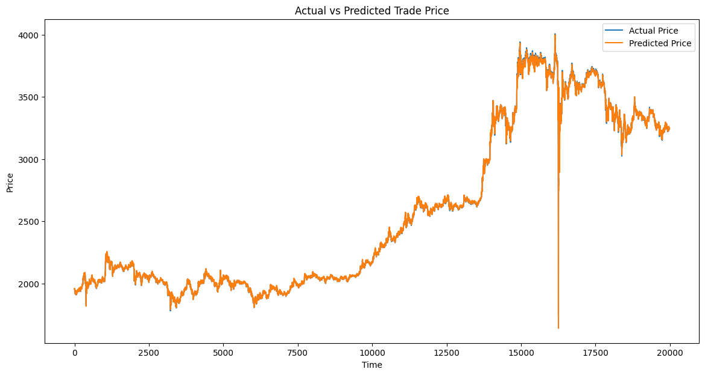

# 동일 조건 실험

## 1번째

small 데이터 시험삼아 돌려봄

```python
input_features = [
    "high_price",
    "low_price",
    "trade_price",
    "candle_acc_trade_volume",
    # "hour",
    # "day_of_week",
    # "is_weekend",
    # "is_morning",
    # "rsi_14",
    # "obv",
    # "macd",
    # "macd_histogram"
]

input_size = len(input_features)
hidden_size = 50
num_layers = 2
output_size = 1
learning_rate = 0.001
num_epochs = 25 # 100
batch_size = 128
```

```
Epoch [1/25], Train Loss: 0.00071532, Test Loss: 0.01858269, Time: 9.33s, Current Time: 2025-01-15 09:37:21
Epoch [2/25], Train Loss: 0.00000229, Test Loss: 0.00824810, Time: 7.41s, Current Time: 2025-01-15 09:37:28
Epoch [3/25], Train Loss: 0.00000169, Test Loss: 0.00371772, Time: 7.76s, Current Time: 2025-01-15 09:37:36
Epoch [4/25], Train Loss: 0.00000169, Test Loss: 0.00270583, Time: 7.73s, Current Time: 2025-01-15 09:37:43
Epoch [5/25], Train Loss: 0.00000202, Test Loss: 0.00198401, Time: 7.45s, Current Time: 2025-01-15 09:37:51
Epoch [6/25], Train Loss: 0.00000164, Test Loss: 0.00126691, Time: 7.44s, Current Time: 2025-01-15 09:37:58
Epoch [7/25], Train Loss: 0.00000172, Test Loss: 0.00111043, Time: 7.71s, Current Time: 2025-01-15 09:38:06
Epoch [8/25], Train Loss: 0.00000165, Test Loss: 0.00082639, Time: 7.88s, Current Time: 2025-01-15 09:38:14
Epoch [9/25], Train Loss: 0.00000186, Test Loss: 0.00066356, Time: 7.90s, Current Time: 2025-01-15 09:38:22
Epoch [10/25], Train Loss: 0.00000172, Test Loss: 0.00060140, Time: 7.94s, Current Time: 2025-01-15 09:38:30
Epoch [11/25], Train Loss: 0.00000189, Test Loss: 0.00055178, Time: 7.68s, Current Time: 2025-01-15 09:38:37
Epoch [12/25], Train Loss: 0.00000139, Test Loss: 0.00042415, Time: 7.87s, Current Time: 2025-01-15 09:38:45
Epoch [13/25], Train Loss: 0.00000134, Test Loss: 0.00028297, Time: 7.94s, Current Time: 2025-01-15 09:38:53
Epoch [14/25], Train Loss: 0.00000152, Test Loss: 0.00022321, Time: 7.93s, Current Time: 2025-01-15 09:39:01
Epoch [15/25], Train Loss: 0.00000130, Test Loss: 0.00036244, Time: 7.88s, Current Time: 2025-01-15 09:39:09
EarlyStopping counter: 1 out of 5
Epoch [16/25], Train Loss: 0.00000111, Test Loss: 0.00019569, Time: 7.89s, Current Time: 2025-01-15 09:39:17
Epoch [17/25], Train Loss: 0.00000118, Test Loss: 0.00012541, Time: 7.88s, Current Time: 2025-01-15 09:39:25
Epoch [18/25], Train Loss: 0.00000113, Test Loss: 0.00014286, Time: 7.84s, Current Time: 2025-01-15 09:39:33
EarlyStopping counter: 1 out of 5
Epoch [19/25], Train Loss: 0.00000098, Test Loss: 0.00026441, Time: 7.93s, Current Time: 2025-01-15 09:39:41
EarlyStopping counter: 2 out of 5
Epoch [20/25], Train Loss: 0.00000107, Test Loss: 0.00016018, Time: 7.73s, Current Time: 2025-01-15 09:39:48
EarlyStopping counter: 3 out of 5
Epoch [21/25], Train Loss: 0.00000089, Test Loss: 0.00018662, Time: 7.89s, Current Time: 2025-01-15 09:39:56
EarlyStopping counter: 4 out of 5
Epoch [22/25], Train Loss: 0.00000059, Test Loss: 0.00014014, Time: 7.76s, Current Time: 2025-01-15 09:40:04
EarlyStopping counter: 5 out of 5
Early stopping
```


```
Actual: 1954.0, Predicted: 1948.09912109375

Actual: 1958.0001220703125, Predicted: 1948.2
496337890625

Actual: 1959.0001220703125, Predicted: 1949.0
347900390625

Actual: 1956.0, Predicted: 1950.41064453125

Actual: 1952.0, Predicted: 1950.33203125

Actual: 1956.0, Predicted: 1948.1893310546875

Actual: 1956.0, Predicted: 1947.913818359375

Actual: 1956.0, Predicted: 1948.1500244140625

Actual: 1952.0, Predicted: 1948.6473388671875

Actual: 1954.0, Predicted: 1947.4140625
```


## 2번째

```
input_features = [
    "high_price",
    "low_price",
    "trade_price",
    "candle_acc_trade_volume",
    # "rsi_14",
    # "macd_histogram",

    # "atr_14",
    # "stoch_k",
    # "stoch_d",
]

input_size = len(input_features)
hidden_size = 50
num_layers = 2
output_size = 1
learning_rate = 0.001
num_epochs = 100 # 100
batch_size = 128

print("hidden_size:", hidden_size)
print("num_layers:", num_layers)
print("num_epochs:", num_epochs)
print("batch_size:", batch_size)
```


```
Epoch [1/100], Train Loss: 0.00083612, Test Loss: 0.01650374, Time: 8.87s, Current Time: 2025-01-15 11:57:41
Epoch [2/100], Train Loss: 0.00000231, Test Loss: 0.00785323, Time: 7.34s, Current Time: 2025-01-15 11:57:49
Epoch [3/100], Train Loss: 0.00000146, Test Loss: 0.00338980, Time: 7.50s, Current Time: 2025-01-15 11:57:56
Epoch [4/100], Train Loss: 0.00000151, Test Loss: 0.00212767, Time: 7.62s, Current Time: 2025-01-15 11:58:04
Epoch [5/100], Train Loss: 0.00000168, Test Loss: 0.00137830, Time: 7.28s, Current Time: 2025-01-15 11:58:11
Epoch [6/100], Train Loss: 0.00000173, Test Loss: 0.00123257, Time: 7.63s, Current Time: 2025-01-15 11:58:19
Epoch [7/100], Train Loss: 0.00000179, Test Loss: 0.00099613, Time: 7.88s, Current Time: 2025-01-15 11:58:27
Epoch [8/100], Train Loss: 0.00000167, Test Loss: 0.00086510, Time: 7.66s, Current Time: 2025-01-15 11:58:34
Epoch [9/100], Train Loss: 0.00000176, Test Loss: 0.00061872, Time: 7.82s, Current Time: 2025-01-15 11:58:42
Epoch [10/100], Train Loss: 0.00000182, Test Loss: 0.00051100, Time: 7.67s, Current Time: 2025-01-15 11:58:50
Epoch [11/100], Train Loss: 0.00000166, Test Loss: 0.00034424, Time: 7.64s, Current Time: 2025-01-15 11:58:58
Epoch [12/100], Train Loss: 0.00000157, Test Loss: 0.00022176, Time: 7.64s, Current Time: 2025-01-15 11:59:05
Epoch [13/100], Train Loss: 0.00000147, Test Loss: 0.00023566, Time: 7.64s, Current Time: 2025-01-15 11:59:13
EarlyStopping counter: 1 out of 10
Epoch [14/100], Train Loss: 0.00000148, Test Loss: 0.00027215, Time: 6.90s, Current Time: 2025-01-15 11:59:20
EarlyStopping counter: 2 out of 10
Epoch [15/100], Train Loss: 0.00000152, Test Loss: 0.00013675, Time: 7.70s, Current Time: 2025-01-15 11:59:27
Epoch [16/100], Train Loss: 0.00000118, Test Loss: 0.00005939, Time: 7.42s, Current Time: 2025-01-15 11:59:35
Epoch [17/100], Train Loss: 0.00000132, Test Loss: 0.00009830, Time: 7.60s, Current Time: 2025-01-15 11:59:42
EarlyStopping counter: 1 out of 10
Epoch [18/100], Train Loss: 0.00000131, Test Loss: 0.00006129, Time: 6.42s, Current Time: 2025-01-15 11:59:49
EarlyStopping counter: 2 out of 10
Epoch [19/100], Train Loss: 0.00000124, Test Loss: 0.00008843, Time: 7.65s, Current Time: 2025-01-15 11:59:56
EarlyStopping counter: 3 out of 10
Epoch [20/100], Train Loss: 0.00000100, Test Loss: 0.00004831, Time: 7.71s, Current Time: 2025-01-15 12:00:04
...
EarlyStopping counter: 9 out of 10
Epoch [46/100], Train Loss: 0.00000032, Test Loss: 0.00002055, Time: 7.57s, Current Time: 2025-01-15 12:03:27
EarlyStopping counter: 10 out of 10
Early stopping
```



```
MAE: 5.8820
MSE: 226.7262
RMSE: 15.0574
R²: 0.9995
```

```

```

```

```

