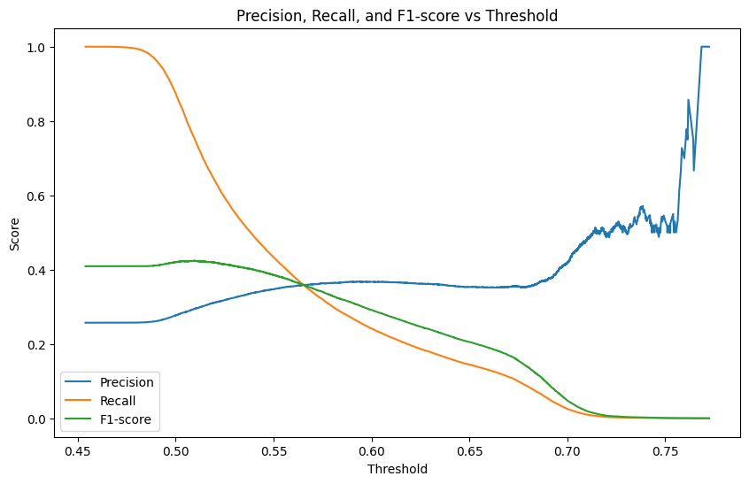

# 상승 하락 구분

## 1. 2025-01-16/KRW-XRP-5m-full-1.pth

```python
input_size = X.shape[2]   # 피처 개수 (ex: 6)
hidden_size = 50          # LSTM hidden 노드 수
num_layers = 2            # LSTM 레이어 수
learning_rate = 0.002
num_epochs = 50
batch_size = 128
```

```
Epoch [1/50] | Train Loss: 0.604637 | Test Loss: 0.579250 | Time: 12.84s
Epoch [2/50] | Train Loss: 0.601968 | Test Loss: 0.584223 | Time: 12.59s
EarlyStopping counter: 1 out of 10
Epoch [3/50] | Train Loss: 0.601084 | Test Loss: 0.579998 | Time: 12.47s
EarlyStopping counter: 2 out of 10
Epoch [4/50] | Train Loss: 0.601361 | Test Loss: 0.578726 | Time: 12.46s
Epoch [5/50] | Train Loss: 0.601181 | Test Loss: 0.578660 | Time: 12.50s
Epoch [6/50] | Train Loss: 0.600880 | Test Loss: 0.573872 | Time: 17.11s
Epoch [7/50] | Train Loss: 0.600501 | Test Loss: 0.567158 | Time: 18.25s
Epoch [8/50] | Train Loss: 0.600382 | Test Loss: 0.585486 | Time: 12.39s
EarlyStopping counter: 1 out of 10
Epoch [9/50] | Train Loss: 0.600196 | Test Loss: 0.576812 | Time: 12.26s
EarlyStopping counter: 2 out of 10
Epoch [10/50] | Train Loss: 0.603024 | Test Loss: 0.578155 | Time: 12.36s
EarlyStopping counter: 3 out of 10
Epoch [11/50] | Train Loss: 0.603538 | Test Loss: 0.588025 | Time: 12.40s
EarlyStopping counter: 4 out of 10
Epoch [12/50] | Train Loss: 0.601635 | Test Loss: 0.572034 | Time: 12.47s
EarlyStopping counter: 5 out of 10
Epoch [13/50] | Train Loss: 0.601117 | Test Loss: 0.585383 | Time: 12.44s
EarlyStopping counter: 6 out of 10
Epoch [14/50] | Train Loss: 0.600704 | Test Loss: 0.575283 | Time: 12.42s
EarlyStopping counter: 7 out of 10
Epoch [15/50] | Train Loss: 0.600408 | Test Loss: 0.585027 | Time: 12.42s
EarlyStopping counter: 8 out of 10
Epoch [16/50] | Train Loss: 0.600168 | Test Loss: 0.575615 | Time: 12.44s
EarlyStopping counter: 9 out of 10
Epoch [17/50] | Train Loss: 0.600069 | Test Loss: 0.573601 | Time: 12.39s
EarlyStopping counter: 10 out of 10
EarlyStopping triggered.
```

```
Accuracy:  0.7429
Precision: 0.5405
Recall:    0.0022
F1-score:  0.0044
[[103916     68]
 [ 35924     80]]
```


## 2. 2025-01-16/KRW-XRP-5m-full-2.pth

```python
# threshhold = 0.1

input_size = X.shape[2]   # 피처 개수 (ex: 6)
hidden_size = 50          # LSTM hidden 노드 수
num_layers = 2            # LSTM 레이어 수
learning_rate = 0.002
num_epochs = 50
batch_size = 128
```

```
Epoch [1/50] | Train Loss: 0.973783 | Test Loss: 0.947076 | Time: 18.96s
Epoch [2/50] | Train Loss: 0.969085 | Test Loss: 0.947272 | Time: 18.70s
EarlyStopping counter: 1 out of 10
Epoch [3/50] | Train Loss: 0.966371 | Test Loss: 0.957821 | Time: 18.07s
EarlyStopping counter: 2 out of 10
Epoch [4/50] | Train Loss: 0.965566 | Test Loss: 0.947392 | Time: 10.61s
EarlyStopping counter: 3 out of 10
Epoch [5/50] | Train Loss: 0.964595 | Test Loss: 0.951800 | Time: 10.62s
EarlyStopping counter: 4 out of 10
Epoch [6/50] | Train Loss: 0.964104 | Test Loss: 0.951146 | Time: 10.61s
EarlyStopping counter: 5 out of 10
Epoch [7/50] | Train Loss: 0.963783 | Test Loss: 0.939065 | Time: 10.63s
Epoch [8/50] | Train Loss: 0.963698 | Test Loss: 0.936433 | Time: 10.61s
Epoch [9/50] | Train Loss: 0.963506 | Test Loss: 0.947556 | Time: 10.62s
EarlyStopping counter: 1 out of 10
Epoch [10/50] | Train Loss: 0.963294 | Test Loss: 0.934156 | Time: 10.62s
Epoch [11/50] | Train Loss: 0.963266 | Test Loss: 0.937260 | Time: 10.63s
EarlyStopping counter: 1 out of 10
Epoch [12/50] | Train Loss: 0.963101 | Test Loss: 0.945446 | Time: 10.63s
EarlyStopping counter: 2 out of 10
Epoch [13/50] | Train Loss: 0.963038 | Test Loss: 0.955666 | Time: 10.65s
EarlyStopping counter: 3 out of 10
Epoch [14/50] | Train Loss: 0.962819 | Test Loss: 0.947706 | Time: 10.65s
EarlyStopping counter: 4 out of 10
Epoch [15/50] | Train Loss: 0.962817 | Test Loss: 0.942848 | Time: 10.65s
...
EarlyStopping counter: 9 out of 10
Epoch [20/50] | Train Loss: 0.962432 | Test Loss: 0.942418 | Time: 10.67s
EarlyStopping counter: 10 out of 10
EarlyStopping triggered.
```


```
Accuracy:  0.3804
Precision: 0.2768
Recall:    0.8740
F1-score:  0.4205


[[TN FP]
 [FN TP]]

[[21777 82207]
 [ 4535 31469]]
```



```
최적의 Threshold: 0.5097
최적의 F1-score: 0.4236
```


## 3. 2025-01-16/KRW-XRP-5m-full-3.pth

```python
input_size = X.shape[2]   # 피처 개수 (ex: 6)
hidden_size = 100          # LSTM hidden 노드 수
num_layers = 2            # LSTM 레이어 수
learning_rate = 0.001
num_epochs = 100
batch_size = 32
```

```
Epoch [1/100] | Train Loss: 0.969130 | Test Loss: 0.966953 | Time: 73.39s
Epoch [2/100] | Train Loss: 0.965278 | Test Loss: 0.958228 | Time: 73.24s
Epoch [3/100] | Train Loss: 0.964414 | Test Loss: 0.954741 | Time: 71.24s
Epoch [4/100] | Train Loss: 0.963978 | Test Loss: 0.956543 | Time: 73.09s
EarlyStopping counter: 1 out of 10
Epoch [5/100] | Train Loss: 0.963808 | Test Loss: 0.960644 | Time: 73.12s
EarlyStopping counter: 2 out of 10
Epoch [6/100] | Train Loss: 0.963931 | Test Loss: 0.950283 | Time: 73.15s
Epoch [7/100] | Train Loss: 0.963398 | Test Loss: 0.944592 | Time: 73.11s
Epoch [8/100] | Train Loss: 0.963121 | Test Loss: 0.972930 | Time: 72.16s
EarlyStopping counter: 1 out of 10
Epoch [9/100] | Train Loss: 0.963349 | Test Loss: 0.944461 | Time: 32.70s
Epoch [10/100] | Train Loss: 0.966786 | Test Loss: 0.940437 | Time: 32.63s
Epoch [11/100] | Train Loss: 0.966709 | Test Loss: 0.964180 | Time: 32.72s
EarlyStopping counter: 1 out of 10
Epoch [12/100] | Train Loss: 0.966437 | Test Loss: 0.941690 | Time: 32.69s
EarlyStopping counter: 2 out of 10
Epoch [13/100] | Train Loss: 0.965876 | Test Loss: 0.958860 | Time: 32.78s
EarlyStopping counter: 3 out of 10
Epoch [14/100] | Train Loss: 0.966303 | Test Loss: 0.957145 | Time: 32.67s
EarlyStopping counter: 4 out of 10
Epoch [15/100] | Train Loss: 0.965014 | Test Loss: 0.945754 | Time: 32.73s
EarlyStopping counter: 5 out of 10
Epoch [16/100] | Train Loss: 0.964315 | Test Loss: 0.945331 | Time: 32.82s
EarlyStopping counter: 6 out of 10
...
EarlyStopping counter: 9 out of 10
Epoch [20/100] | Train Loss: 0.963222 | Test Loss: 0.950373 | Time: 32.63s
EarlyStopping counter: 10 out of 10
EarlyStopping triggered.
```

```
Accuracy:  0.6394
Precision: 0.3438
Recall:    0.4424
F1-score:  0.3869
[[TN FP]
 [FN TP]]
[[73588 30396]
 [20077 15927]]
```
