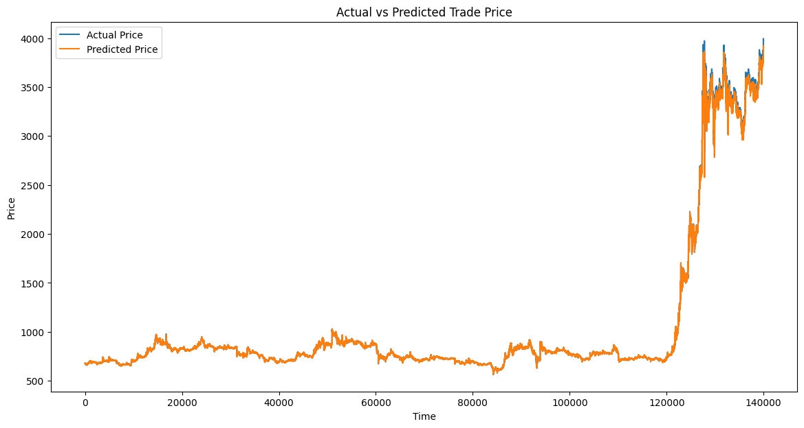

# 5붕봉 full 데이터

## 1. 2025-01-14/KRW-XRP-5m-full-1.pth

```python
# 선택된 피처 리스트
input_features = [
    "high_price",
    "low_price",
    "trade_price",
    "candle_acc_trade_volume",
    "rsi_14",
    "macd_histogram",

    # "atr_14",
    # "stoch_k",
    # "stoch_d",
]

input_size = len(input_features)
hidden_size = 100
num_layers = 2
output_size = 1
learning_rate = 0.0005
num_epochs = 200 # 100
batch_size = 128

print("hidden_size:", hidden_size)
print("num_layers:", num_layers)
print("num_epochs:", num_epochs)
print("batch_size:", batch_size)
```


```
Epoch [1/200], Train Loss: 0.000125106361, Test Loss: 0.000102647842, Time: 55.77s, Current Time: 2025-01-16 05:39:19
Epoch [2/200], Train Loss: 0.000002361011, Test Loss: 0.000019591067, Time: 53.97s, Current Time: 2025-01-16 05:40:13
Epoch [3/200], Train Loss: 0.000001839896, Test Loss: 0.000023278828, Time: 54.51s, Current Time: 2025-01-16 05:41:07
EarlyStopping counter: 1 out of 10
Epoch [4/200], Train Loss: 0.000001388504, Test Loss: 0.000009621593, Time: 54.69s, Current Time: 2025-01-16 05:42:02
Epoch [5/200], Train Loss: 0.000001188785, Test Loss: 0.000016236603, Time: 54.90s, Current Time: 2025-01-16 05:42:57
EarlyStopping counter: 1 out of 10
Epoch [6/200], Train Loss: 0.000001107881, Test Loss: 0.000022194482, Time: 54.84s, Current Time: 2025-01-16 05:43:52
EarlyStopping counter: 2 out of 10
Epoch [7/200], Train Loss: 0.000001023531, Test Loss: 0.000026258020, Time: 54.96s, Current Time: 2025-01-16 05:44:47
EarlyStopping counter: 3 out of 10
Epoch [8/200], Train Loss: 0.000001003589, Test Loss: 0.000035588136, Time: 55.01s, Current Time: 2025-01-16 05:45:42
EarlyStopping counter: 4 out of 10
Epoch [9/200], Train Loss: 0.000000774814, Test Loss: 0.000016833125, Time: 54.95s, Current Time: 2025-01-16 05:46:37
EarlyStopping counter: 5 out of 10
Epoch [10/200], Train Loss: 0.000000778683, Test Loss: 0.000006858650, Time: 54.93s, Current Time: 2025-01-16 05:47:31
Epoch [11/200], Train Loss: 0.000000777233, Test Loss: 0.000006264865, Time: 54.63s, Current Time: 2025-01-16 05:48:26
Epoch [12/200], Train Loss: 0.000000781741, Test Loss: 0.000014539819, Time: 55.68s, Current Time: 2025-01-16 05:49:22
EarlyStopping counter: 1 out of 10
Epoch [13/200], Train Loss: 0.000000764233, Test Loss: 0.000017934708, Time: 52.25s, Current Time: 2025-01-16 05:50:14
EarlyStopping counter: 2 out of 10
Epoch [14/200], Train Loss: 0.000000771913, Test Loss: 0.000016498112, Time: 51.47s, Current Time: 2025-01-16 05:51:05
EarlyStopping counter: 3 out of 10
Epoch [15/200], Train Loss: 0.000000759093, Test Loss: 0.000016931840, Time: 54.69s, Current Time: 2025-01-16 05:52:00
EarlyStopping counter: 4 out of 10
...
EarlyStopping counter: 9 out of 10
Epoch [21/200], Train Loss: 0.000000647559, Test Loss: 0.000009658421, Time: 54.72s, Current Time: 2025-01-16 05:57:29
EarlyStopping counter: 10 out of 10
Early stopping

```




```
MAE: 4.3194
MSE: 142.4193
RMSE: 11.9340
R²: 0.9998
```


```
Actual: 679.0, Predicted: 679.7511596679688
Actual: 679.0, Predicted: 679.0657958984375
Actual: 679.0, Predicted: 678.8098754882812
Actual: 679.0, Predicted: 678.8370361328125
Actual: 679.0, Predicted: 678.4446411132812
Actual: 679.0, Predicted: 678.9222412109375
Actual: 678.0, Predicted: 678.4453735351562
Actual: 678.0, Predicted: 677.9664306640625
Actual: 678.0, Predicted: 677.9813232421875
Actual: 679.0, Predicted: 677.9485473632812
```