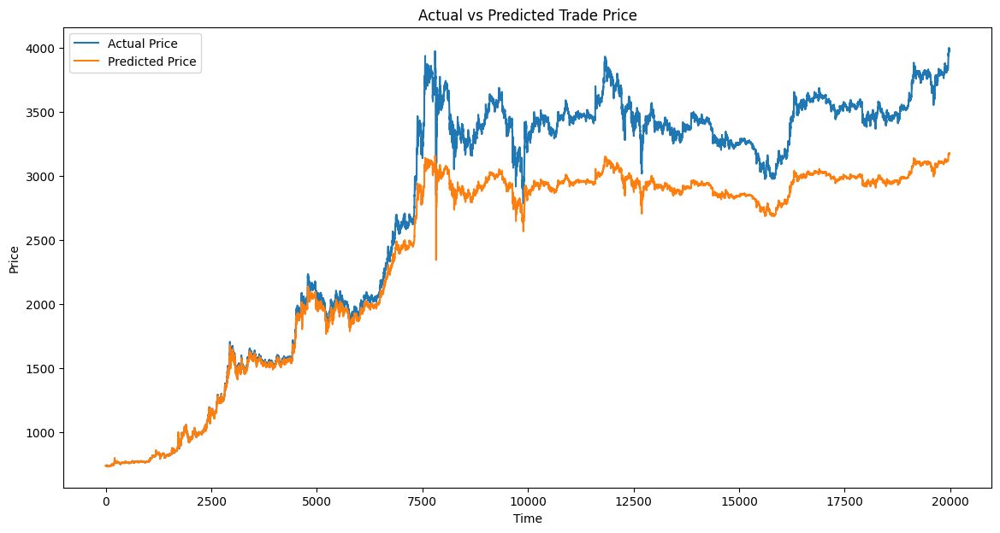
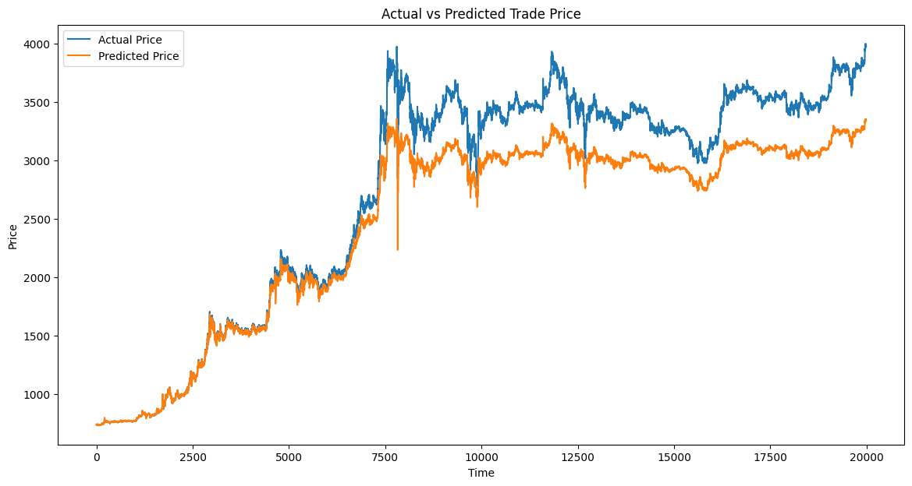

# 5분봉 small 데이터

# 1. 2025-01-14/KRW-XRP-5m-small-1.pth

```python
input_features = [
    "high_price",
    "low_price",
    "trade_price",
    "candle_acc_trade_volume",
    "rsi_14",
    "macd_histogram",

    # "atr_14",
    # "stoch_k",
    # "stoch_d",
]

input_size = len(input_features)
hidden_size = 50
num_layers = 2
output_size = 1
learning_rate = 0.001
num_epochs = 200 # 100
batch_size = 128

print("hidden_size:", hidden_size)
print("num_layers:", num_layers)
print("num_epochs:", num_epochs)
print("batch_size:", batch_size)

```

```
Epoch [1/200], Train Loss: 0.000132965279, Test Loss: 0.114407417905, Time: 8.82s, Current Time: 2025-01-16 05:15:56
Epoch [2/200], Train Loss: 0.000000858933, Test Loss: 0.105994608752, Time: 7.46s, Current Time: 2025-01-16 05:16:03
Epoch [3/200], Train Loss: 0.000000937145, Test Loss: 0.095226142205, Time: 7.71s, Current Time: 2025-01-16 05:16:11
Epoch [4/200], Train Loss: 0.000000877151, Test Loss: 0.087645688712, Time: 7.86s, Current Time: 2025-01-16 05:16:19
Epoch [5/200], Train Loss: 0.000000884142, Test Loss: 0.080133222585, Time: 7.83s, Current Time: 2025-01-16 05:16:27
Epoch [6/200], Train Loss: 0.000000921243, Test Loss: 0.073967722232, Time: 7.85s, Current Time: 2025-01-16 05:16:35
Epoch [7/200], Train Loss: 0.000000851473, Test Loss: 0.069707617708, Time: 7.88s, Current Time: 2025-01-16 05:16:43
Epoch [8/200], Train Loss: 0.000000911827, Test Loss: 0.063972005919, Time: 7.82s, Current Time: 2025-01-16 05:16:50
Epoch [9/200], Train Loss: 0.000000756415, Test Loss: 0.059037224681, Time: 7.82s, Current Time: 2025-01-16 05:16:58
Epoch [10/200], Train Loss: 0.000000792979, Test Loss: 0.054042227142, Time: 7.84s, Current Time: 2025-01-16 05:17:06
Epoch [11/200], Train Loss: 0.000000682800, Test Loss: 0.050380127295, Time: 7.86s, Current Time: 2025-01-16 05:17:14
Epoch [12/200], Train Loss: 0.000000763433, Test Loss: 0.046645767268, Time: 7.53s, Current Time: 2025-01-16 05:17:21
Epoch [13/200], Train Loss: 0.000000742597, Test Loss: 0.042943755381, Time: 7.53s, Current Time: 2025-01-16 05:17:29
Epoch [14/200], Train Loss: 0.000000628949, Test Loss: 0.039105443541, Time: 7.60s, Current Time: 2025-01-16 05:17:37
Epoch [15/200], Train Loss: 0.000000585964, Test Loss: 0.033828131451, Time: 7.93s, Current Time: 2025-01-16 05:17:45
Epoch [16/200], Train Loss: 0.000000609107, Test Loss: 0.030354230304, Time: 7.95s, Current Time: 2025-01-16 05:17:52
Epoch [17/200], Train Loss: 0.000000508644, Test Loss: 0.027258310855, Time: 7.96s, Current Time: 2025-01-16 05:18:00
Epoch [18/200], Train Loss: 0.000000536805, Test Loss: 0.023267544456, Time: 7.95s, Current Time: 2025-01-16 05:18:08
Epoch [19/200], Train Loss: 0.000000519719, Test Loss: 0.021826653045, Time: 7.96s, Current Time: 2025-01-16 05:18:16
Epoch [20/200], Train Loss: 0.000000452661, Test Loss: 0.019794762082, Time: 7.95s, Current Time: 2025-01-16 05:18:24
Epoch [21/200], Train Loss: 0.000000440362, Test Loss: 0.018640863024, Time: 8.01s, Current Time: 2025-01-16 05:18:32
Epoch [22/200], Train Loss: 0.000000479216, Test Loss: 0.017031896781, Time: 7.94s, Current Time: 2025-01-16 05:18:40
Epoch [23/200], Train Loss: 0.000000433089, Test Loss: 0.016256973676, Time: 7.94s, Current Time: 2025-01-16 05:18:48
Epoch [24/200], Train Loss: 0.000000390434, Test Loss: 0.013699364578, Time: 7.92s, Current Time: 2025-01-16 05:18:56
Epoch [25/200], Train Loss: 0.000000391414, Test Loss: 0.012820147206, Time: 7.99s, Current Time: 2025-01-16 05:19:04
...
EarlyStopping counter: 9 out of 10
Epoch [41/200], Train Loss: 0.000000259371, Test Loss: 0.014577086825, Time: 7.95s, Current Time: 2025-01-16 05:21:11
EarlyStopping counter: 10 out of 10
Early stopping
```




```
Actual: 736.7000122070312, Predicted: 736.6790771484375
Actual: 735.5999755859375, Predicted: 736.8524169921875
Actual: 733.7000122070312, Predicted: 735.5853881835938
Actual: 733.199951171875, Predicted: 734.321044921875
Actual: 734.2000122070312, Predicted: 733.0269775390625
Actual: 734.2999877929688, Predicted: 734.4133911132812
Actual: 734.800048828125, Predicted: 734.5801391601562
Actual: 735.9000244140625, Predicted: 734.8446044921875
Actual: 736.9000244140625, Predicted: 736.2557983398438
Actual: 737.7999877929688, Predicted: 736.8916015625


```
## 2. 2025-01-14/KRW-XRP-5m-small-2.pth


```python
# 선택된 피처 리스트
input_features = [
    "high_price",
    "low_price",
    "trade_price",
    "candle_acc_trade_volume",
    "rsi_14",
    "macd_histogram",

    # "atr_14",
    # "stoch_k",
    # "stoch_d",
]

input_size = len(input_features)
hidden_size = 100
num_layers = 2
output_size = 1
learning_rate = 0.001
num_epochs = 200 # 100
batch_size = 128

print("hidden_size:", hidden_size)
print("num_layers:", num_layers)
print("num_epochs:", num_epochs)
print("batch_size:", batch_size)
```


```
Epoch [1/200], Train Loss: 0.000134366417, Test Loss: 0.080920037737, Time: 9.02s, Current Time: 2025-01-16 05:25:16
Epoch [2/200], Train Loss: 0.000000886342, Test Loss: 0.072426273649, Time: 7.37s, Current Time: 2025-01-16 05:25:23
Epoch [3/200], Train Loss: 0.000001060746, Test Loss: 0.062560465426, Time: 7.69s, Current Time: 2025-01-16 05:25:31
Epoch [4/200], Train Loss: 0.000001070244, Test Loss: 0.053099801901, Time: 7.99s, Current Time: 2025-01-16 05:25:39
Epoch [5/200], Train Loss: 0.000001128325, Test Loss: 0.044959598691, Time: 7.80s, Current Time: 2025-01-16 05:25:47
Epoch [6/200], Train Loss: 0.000001083969, Test Loss: 0.039460977791, Time: 8.02s, Current Time: 2025-01-16 05:25:55
Epoch [7/200], Train Loss: 0.000001006375, Test Loss: 0.034143064039, Time: 7.96s, Current Time: 2025-01-16 05:26:03
Epoch [8/200], Train Loss: 0.000001100511, Test Loss: 0.033389149036, Time: 7.98s, Current Time: 2025-01-16 05:26:11
Epoch [9/200], Train Loss: 0.000000995325, Test Loss: 0.026931399778, Time: 8.06s, Current Time: 2025-01-16 05:26:19
Epoch [10/200], Train Loss: 0.000000898090, Test Loss: 0.027973309356, Time: 8.03s, Current Time: 2025-01-16 05:26:27
EarlyStopping counter: 1 out of 10
Epoch [11/200], Train Loss: 0.000000889855, Test Loss: 0.025876917422, Time: 8.02s, Current Time: 2025-01-16 05:26:35
Epoch [12/200], Train Loss: 0.000000772147, Test Loss: 0.024767341305, Time: 8.06s, Current Time: 2025-01-16 05:26:43
Epoch [13/200], Train Loss: 0.000000722649, Test Loss: 0.022312759116, Time: 8.03s, Current Time: 2025-01-16 05:26:51
Epoch [14/200], Train Loss: 0.000000689521, Test Loss: 0.018747311610, Time: 8.04s, Current Time: 2025-01-16 05:26:59
Epoch [15/200], Train Loss: 0.000000696063, Test Loss: 0.016591396616, Time: 8.03s, Current Time: 2025-01-16 05:27:07
Epoch [16/200], Train Loss: 0.000000652371, Test Loss: 0.016565576317, Time: 8.06s, Current Time: 2025-01-16 05:27:15
Epoch [17/200], Train Loss: 0.000000563445, Test Loss: 0.016438747778, Time: 8.05s, Current Time: 2025-01-16 05:27:23
Epoch [18/200], Train Loss: 0.000000548192, Test Loss: 0.013623043437, Time: 8.05s, Current Time: 2025-01-16 05:27:31
Epoch [19/200], Train Loss: 0.000000571976, Test Loss: 0.013067918017, Time: 8.04s, Current Time: 2025-01-16 05:27:39
Epoch [20/200], Train Loss: 0.000000479588, Test Loss: 0.013355847118, Time: 8.06s, Current Time: 2025-01-16 05:27:47
EarlyStopping counter: 1 out of 10
Epoch [21/200], Train Loss: 0.000000512605, Test Loss: 0.013719040126, Time: 8.00s, Current Time: 2025-01-16 05:27:55
EarlyStopping counter: 2 out of 10
Epoch [22/200], Train Loss: 0.000000454493, Test Loss: 0.010176472360, Time: 7.96s, Current Time: 2025-01-16 05:28:03
Epoch [23/200], Train Loss: 0.000000426483, Test Loss: 0.012680494893, Time: 7.99s, Current Time: 2025-01-16 05:28:11
EarlyStopping counter: 1 out of 10
Epoch [24/200], Train Loss: 0.000000458474, Test Loss: 0.010315066871, Time: 7.93s, Current Time: 2025-01-16 05:28:19
EarlyStopping counter: 2 out of 10
Epoch [25/200], Train Loss: 0.000000437297, Test Loss: 0.010034436701, Time: 7.98s, Current Time: 2025-01-16 05:28:27
Epoch [26/200], Train Loss: 0.000000407258, Test Loss: 0.010382161088, Time: 7.91s, Current Time: 2025-01-16 05:28:35
EarlyStopping counter: 1 out of 10
Epoch [27/200], Train Loss: 0.000000412614, Test Loss: 0.009452163524, Time: 7.93s, Current Time: 2025-01-16 05:28:43
Epoch [28/200], Train Loss: 0.000000416475, Test Loss: 0.010015212767, Time: 7.95s, Current Time: 2025-01-16 05:28:51
EarlyStopping counter: 1 out of 10
Epoch [29/200], Train Loss: 0.000000395284, Test Loss: 0.010264643735, Time: 7.97s, Current Time: 2025-01-16 05:28:59
EarlyStopping counter: 2 out of 10
Epoch [30/200], Train Loss: 0.000000367865, Test Loss: 0.010029666502, Time: 7.95s, Current Time: 2025-01-16 05:29:07
EarlyStopping counter: 3 out of 10
Epoch [31/200], Train Loss: 0.000000394741, Test Loss: 0.009587667534, Time: 7.95s, Current Time: 2025-01-16 05:29:15
EarlyStopping counter: 4 out of 10
Epoch [32/200], Train Loss: 0.000000271346, Test Loss: 0.009028724003, Time: 8.02s, Current Time: 2025-01-16 05:29:23
Epoch [33/200], Train Loss: 0.000000289578, Test Loss: 0.009305466552, Time: 8.03s, Current Time: 2025-01-16 05:29:31
EarlyStopping counter: 1 out of 10
Epoch [34/200], Train Loss: 0.000000297851, Test Loss: 0.009470030434, Time: 8.09s, Current Time: 2025-01-16 05:29:39
EarlyStopping counter: 2 out of 10
Epoch [35/200], Train Loss: 0.000000291871, Test Loss: 0.009367830670, Time: 8.06s, Current Time: 2025-01-16 05:29:47
EarlyStopping counter: 3 out of 10
Epoch [36/200], Train Loss: 0.000000305692, Test Loss: 0.008746742137, Time: 8.14s, Current Time: 2025-01-16 05:29:55
Epoch [37/200], Train Loss: 0.000000299280, Test Loss: 0.008929683881, Time: 8.10s, Current Time: 2025-01-16 05:30:03
EarlyStopping counter: 1 out of 10
Epoch [38/200], Train Loss: 0.000000309008, Test Loss: 0.009972937436, Time: 8.09s, Current Time: 2025-01-16 05:30:11
EarlyStopping counter: 2 out of 10
Epoch [39/200], Train Loss: 0.000000300202, Test Loss: 0.008837368020, Time: 8.03s, Current Time: 2025-01-16 05:30:19
EarlyStopping counter: 3 out of 10
Epoch [40/200], Train Loss: 0.000000299511, Test Loss: 0.008939234965, Time: 8.06s, Current Time: 2025-01-16 05:30:27
EarlyStopping counter: 4 out of 10
Epoch [41/200], Train Loss: 0.000000261479, Test Loss: 0.009122641694, Time: 8.06s, Current Time: 2025-01-16 05:30:35
EarlyStopping counter: 5 out of 10
Epoch [42/200], Train Loss: 0.000000263921, Test Loss: 0.009092116481, Time: 8.12s, Current Time: 2025-01-16 05:30:43
EarlyStopping counter: 6 out of 10
Epoch [43/200], Train Loss: 0.000000260847, Test Loss: 0.008780041569, Time: 8.07s, Current Time: 2025-01-16 05:30:51
EarlyStopping counter: 7 out of 10
Epoch [44/200], Train Loss: 0.000000273131, Test Loss: 0.008882116125, Time: 8.07s, Current Time: 2025-01-16 05:31:00
EarlyStopping counter: 8 out of 10
Epoch [45/200], Train Loss: 0.000000248752, Test Loss: 0.009099105333, Time: 8.10s, Current Time: 2025-01-16 05:31:08
EarlyStopping counter: 9 out of 10
Epoch [46/200], Train Loss: 0.000000254949, Test Loss: 0.009207370705, Time: 8.03s, Current Time: 2025-01-16 05:31:16
EarlyStopping counter: 10 out of 10
Early stopping
```


```
MAE: 267.7887
MSE: 108513.3281
RMSE: 329.4136
R²: 0.8917
```


```
Actual: 736.7000122070312, Predicted: 736.817626953125
Actual: 735.5999755859375, Predicted: 736.9835205078125
Actual: 733.7000122070312, Predicted: 735.6779174804688
Actual: 733.199951171875, Predicted: 734.3197021484375
Actual: 734.2000122070312, Predicted: 732.9141235351562
Actual: 734.2999877929688, Predicted: 734.3275756835938
Actual: 734.800048828125, Predicted: 734.552490234375
Actual: 735.9000244140625, Predicted: 734.8082885742188
Actual: 736.9000244140625, Predicted: 736.281982421875
Actual: 737.7999877929688, Predicted: 736.8546752929688
```


